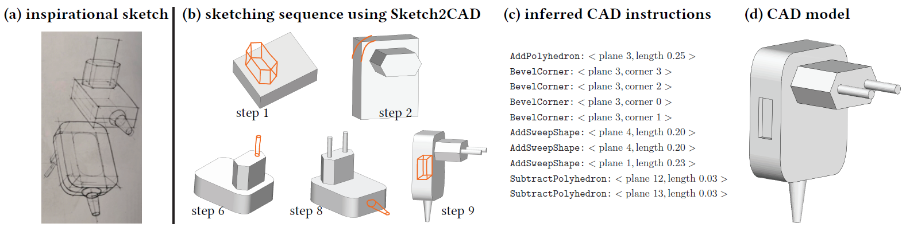

# Sketch2CAD: Sequential CAD Modeling by Sketching in Context

## Introduction
This repository contains the implementation of [Sktech2CAD](http://geometry.cs.ucl.ac.uk/projects/2020/sketch2cad/) proposed in our SIGGRAPH Asia 2020 paper.
* **Sketch2CAD: Sequential CAD Modeling by Sketching in Context** 
By [Changjian Li](https://enigma-li.github.io/), [Hao Pan](http://haopan.github.io/), [Adrien Bousseau](http://www-sop.inria.fr/members/Adrien.Bousseau/), [Niloy Mitra](http://www0.cs.ucl.ac.uk/staff/n.mitra/), 
*ACM Trans. Graphics, 39(6), 2020, proceedings of SIGGRAPH Asia 2020.*

It contains two parts: 1) **network training**, 2) **training dataset** and **trained network deployment** (e.g., for interactive modeling).

The code is released under the MIT license.

### Network training
This part contains the **Python** code for building, training and testing the nueral network using [TensorFlow](https://www.tensorflow.org/). 

Please read README file within the *networkTraining* folder for more details.

### Training dataset and network deployment
This part contains the code for deploying the trained network in a C++ project that can be an interactive 3D modeling application. It also provides instructions to download the training dataset we generated, and our trained networks. 

Please read the README file in *dataAndModel* folder for more details.

### Prototype System
We released the prototype system for research use, feel free to download and try it. More instructions to download it, please refer to the [project page](http://geometry.cs.ucl.ac.uk/projects/2020/sketch2cad/).

## Citation
If you use our code or model, please cite our paper:
 
 Bibtex coming soon ...
 
## Contact
Any question you could contact Changjian Li (chjili2011@gmail.com) or Hao Pan (haopan@microsoft.com) for help.

